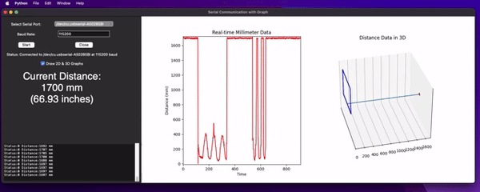

# Serial Communication GUI Project for Laser Range Sensor

This project provides a Python-based graphical user interface (GUI) for real-time serial communication. The GUI displays incoming distance data on both 2D and 3D plots, with an option to toggle the display of these graphs. The distance is shown in both millimeters and inches.

## Device 
**Single-point TOF Laser Ranging Sensor**

[](https://www.makerfabs.com/single-point-tof-laser-ranging-sensor.html)

The innovative pulse TOF principle enables this sensor measuring distance to be realised at 20 meters. This ensures that the accuracy of the measurement remains consistent regardless of distance. The accuracy is controlled at +/-5 cm, with measurement fluctuations of <3 cm. This approach ensures the continued stability of the distance measurement and accurate measurement , which made this sensor suitable for use in a variety of scenarios, Robot obstacle avoidance, intelligent transportation, car collision avoidance, security monitoring, material level meter etc...


## Serial Application Features

- **Real-time Serial Data Visualization**: Displays distance data from a serial port in 2D and 3D plots.
- **Dynamic Graph Updates**: The GUI updates the graphs in real-time as new data is received.
- **Distance Conversion**: Converts and displays distance in both millimeters (mm) and inches.
- **Customizable Serial Settings**: Easily select the serial port and set the baud rate.
- **Control Graph Display**: Toggle the drawing of 2D and 3D graphs with a checkbox.

    

## Prerequisites

Before you begin, ensure you have met the following requirements:

- **Python 3.x** installed on your system. You can download it from the [official Python website](https://www.python.org/downloads/).
- **Pip** package installer for Python (usually included with Python installations).

## Installation

1. **Clone the Repository**
   ```bash
   git clone https://github.com/0015/Python_Serial_Range_Finder.git
   cd Python_Serial_Range_Finder
   ```
2. **Set Up a Virtual Environment (Optional but Recommended)**
   ```bash
   python -m venv serial_venv
   ```

    **Activate the virtual environment**

    On Windows: 
    ```bash
    serial_venv\Scripts\activate
    ```

    On macOS/Linux:
    ```bash
    source serial_venv/bin/activate
    ```
3. **Install Dependencies**
    ```bash
    pip install -r requirements.txt
    ```

## Usage

1. **Connect Your Serial Device**
    * Ensure your device is connected to the computer and is sending data over a serial port.
2. **Run the Application**
    ```bash
    python serial_gui.py
    ```
3. **Select the Serial Port and Baud Rate**
    * In the GUI, select the appropriate serial port from the dropdown menu.
    * Enter the baud rate (default is 115200).

4. **Start Data Collection**
    * Click the "Start" button to begin reading and displaying data.
5. **Toggle Graph Display**
    * Use the "Draw 2D & 3D Graphs" checkbox to enable or disable the plotting of the data.
6. **Close the Application**    
    * Click the "Close" button to stop the data collection and disconnect from the serial port.

## Contributing    
If you'd like to contribute to this project, feel free to fork the repository and submit a pull request. Issues and suggestions are also welcome.

## License
This project is licensed under the MIT License. See the LICENSE file for more details.
